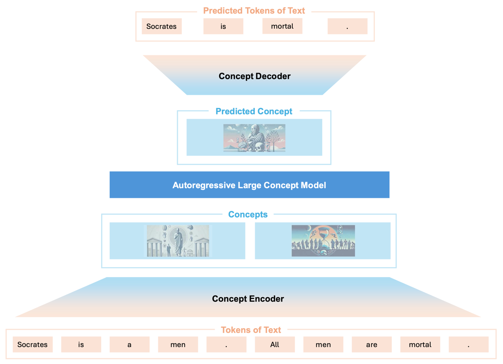

# Large Concept Models
An attempt to improve llm performance by using AlphaZero-like Monte Carlo 
tree search in the space of possible concepts with [JEPA](https://openreview.net/pdf?id=BZ5a1r-kVsf)-type architectures.

## The problems of current autoregressive language models
Here is a list of current inefficiencies of frontier language models.
1. ### LLMs spend a constant amount of compute to predict each token
In fact, the amount of compute is the one of a forward pass of the network.
2. ### LLMs are stateless
The only information carried from the generation of a token to the 
generation of the following tokens is in the generated tokens. 
So the information regarding the following quantities get lost 
after every token choice:
- The internal state of the model (layer activations)
- The contextual embedding of all the tokens in the context window apart 
from the last token
This is a potential waste of compute, as the model has to recompute the 
same information multiple times. and does not build on its previous computations.

This is particularly important when the model is not deep enough to arrive to 
the right conclusion in a single forward pass, but would be able to do so in
few passes.
3. ### Information is lost when a token is selected
In fact, the model produces for the token to generate a vector 
in the embedding space. This vector gets converted to a probability 
distribution over the vocabulary, and finally single token is sampled 
from it. So the model is converting the potentially infinite information
contained in the embedding vector (because the coefficients of the vector 
are in principle continuous numbers) to a single token.

This is analogous to do a measure in quantum mechanics, and quantum 
computers taught us that it is exponentially convenient to do all the
calculations in the rich continuous space and delay the measure as far as possible. 

4. ### LLMs do not backtrack on generated tokens
5. ### LLMs can not explore the whole generation space

## Partial solutions and their limitations

1. ### Constant compute per token
MoD. Hard to train, Architecture specific.
This problem has partially been addressed by [Mixture of Depths](https://arxiv.org/abs/2404.02258) 
architectures, that dynamically allocate compute to tokens based on 
the difficulty of predicting each token. This cleaver methodology 
has two main limitations: 
- **They are architecture specific**: In fact they are tied to the 
transformer architecture, which might not be the 

2. ### Statelessness
Reasoning Tokens: spends compute in figuring out the exact word
3. ### Information loss in generated token choice
MCTS on words, Reasoning tokens
4. ### No Backtracking
CoT, improvement is arbitrary, not optimal
5. ### Generation space is too big to explore
ToT, MCTS on words too expensive, scales with depth
## The final Answer: Large Concept Models

---- Old Version ----

## Key Idea
To better understand what makes large concept models useful, we can go through 3 steps:
1. **The exploration problem**: it often happens that LLMs might be able to recognize the correct 
    answer, but they are not able to generate it in the first place (see
    [Chain-of-Thought Reasoning Without Prompting](https://arxiv.org/abs/2402.10200)).
    
    This can happen because the generation process is a search problem on the space of possible sentences.
    Since the search space is often too big to search exhaustively, the model needs to rely on heuristics 
    for the exploration.
    
    Common heuristics like beam search still prioritize inference speed over exhaustive exploration, 
    often at the expense of quality.

2. **The root cause of the exploration problem**: I argue that for the most difficult questions, the
compute that the model spends is badly allocated. For example, if a question requires a yes or no answer,
the model might start the answer with a "yes" or a "no", having used only the compute of a single 
forward pass , and the rest of the computation is used only to continue the answer with correct 
synthax and grammar, not to solve the problem. 
In fact, having the first word already fixed as "yes" or "no" will greatly influence future token 
probabilities, making it very unlikely for the model to change its mind.
## Main limitations of current ways to address the exploration problem
Throughout the years, the exploration problem has been addressed in multiple ways:
 1. **[Chain of thought](https://arxiv.org/abs/2201.11903) and [tree of thought](https://arxiv.org/abs/2305.10601)
methodologies**:  that give the model more forward passes 
(and consequently more compute) before having it settle on a final answer. Unfortunately, 
while these methods have shown improvements over the baseline, they just move the point of failure 
only slightly in the problem complexity axis, signaling the need for an ultimate solution rather 
than a workaround. 
2. **[Mixture of Depths](https://arxiv.org/abs/2404.02258)**: a method that dynamically allocates 
compute to tokens based on the difficulty of predicting each token. This cleaver methodology has
two main limitations:
    - **Hard to train**: since only the difficult tokens will 
    - ****: since layer activation does not follow a statistics compatible with problem solving,
   where we would expect very few tokens to go through the whole network, and many tokens only 
   going through a shallow path. This is because 
    - **Architecture dependent** Transformer based, and 
# The birth of Large Concept Models
1. **A model of irreducible complexity** 
2. **The enabler of exploration in the concept space** 

## Roadmap
to implement the project we will need:

- A language model where we do have access to the logits after the decoder pass is completed (and prior to the application of the generation strategy)
- A Monte Carlo Tree Search Implementation

## Language Model
Possible candidates for the language model are:
- GPT-2
- LLama3.1 - 8b

## Benchmarks

