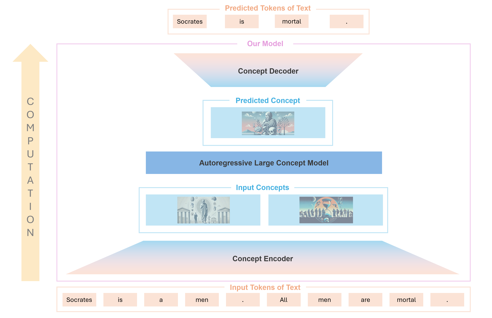

# Large Concept Models
An attempt to improve llm performance by using AlphaZero-like Monte Carlo 
tree search in the space of possible concepts with [JEPA](https://openreview.net/pdf?id=BZ5a1r-kVsf)-type architectures.

The idea we are implementing is called Large Concept Models, and is 
a Large Language Models architecture in the space of possible concepts. 

Current Language Models are autoregressive, 
meaning they only think one token (roughly one word) at a time.

Significant improvement could be made by forcing the model to reason
in a space of possible concepts, that is far more rich and complex 
than the space of possible words, and only translate to actual words
when the reasoning is finished and the model needs to communicate it
to the user. This is analogous to quantum computers, where the bulk 
of the computation is done in the complex quantum space, 
and only when the result is achieved in the quantum state, 
a measure is done, forcing a quantum bits to collapse to 
simple classical bits.

Here are 5 ways current Large Language Models waste compute, 
and below is  how the LCM architecture addresses all of them.

## Main problems of current LLMs approaches

1. ### LLMs spend a constant amount of compute to predict each token
Independently of it being a simple article or the solution to a difficult problem. In fact, the amount of compute is the one of a forward pass of the network.

2. ### LLMs are stateless
The only information carried from the generation of a token to the generation of the following tokens is in the generated tokens. It would be like trying to solve a difficult problem, but only being able to think one word about it, write it down on a piece of paper, then forget everything you just thought and start over. 
So the model does not build on previous computation, it needs to recompute all the relevant information to answer every time it generates a new token.This is particularly important when the model is not deep enough to arrive to the right conclusion in a single forward pass, but would be able to do so in few passes.

3. ### Information is lost when a token is selected
In fact, the model produces for the token to generate a vector in the embedding space. This vector gets converted to a probability distribution over the vocabulary, and finally a single token is sampled from it. So the model is converting the potentially infinite information contained in the embedding vector (because the coefficients of the vector are in principle continuous numbers) to a single token.

4. ### LLMs do not backtrack on generated tokens
So if they generate a wrong token they are influenced by it for the rest of the generation process

5. ### LLMs can not explore the whole generation space
Because the space of possible sentences is too big (possible sentences grow exponentially with the number of words in a sentence)
This implies that  even if the model might recognise the right sentence once it sees it, it might not be able to generate it in the first place.

## The  solution: Large Concept Model architecture
### Overview
The main idea is to build an autoregressive system, that instead of predicting the next word can predict the next concept. 

To do so, we need to build:
* **A concept encoder**: that takes few words and translates them in a high dimensional vector that represents the concept underlying the words.
* **A concept decoder**: that takes this concept vector and turns it into words
* **An autoregressive model on the space of possible concepts**: that given all previous concepts predicts the next one. 

*in the Image above, the model is predicting the next concept given the previous ones. The concepts are then decoded into words.*

### Training procedure
The autoregressive part can be trained in a self-supervised way, analogously to current LLMs. The encoder and decoder parts can be trained as part of an autoencoder, that is tasked with producing sentences that are synonyms with a given sentence. The autoencoder discriminator training loss can be elicited by  fine-tuning small Language Models on datasets of synonyms present online. 

### Advantages of the LCM architecture

We can introduce concept of type reasoning, that are not decoded into words, but use a forward pass of the neural network. By doing so, we can store info about a forward pass of the network in the concept sequence, and retrieve it in all future forward pass. Hence we are able to increase the effective depth of the network indefinitely in linear time!

Since a reasoning can be expressed in fewer concepts with respect to words, it becomes possible to do a Monte Carlo tree search in the space of possible concepts, and once the optimal reasoning in the space of concept is found, it gets decoded into words. 

Let's see how this architecture solves all the problems listed above:
1. Constant compute per token: The compute is allocated mainly to discover the possible concepts, and once that part is done, a small amount of compute gets used to translate it into words. If a concept is complex, the model can allocate an arbitrary number of reasoning concepts (and hence computation) to try to predict it better.
2. Statelessness: Reasoning concepts bring the information of an entire forward pass of the network. the n-th reasoning concepts brings the information of n consecutive passes of the network (it is like multiplying the depth by n).
3. Lost information when token is selected: We don't select a token, but remain in the space of concepts until the model is done reasoning. 
4. No Backtracking: Since to express a reasoning we require far fewer concepts than words, we have the ability to do a Monte Carlo tree search on concepts, thus we can backtrack as many times as we need before finding the right reasoning.
5. Generation space too big to explore: Actually, since the number of possible paths is exponential in length of the generated sequence, using concepts instead of tokens leads to an exponential advantage, and it becomes possible to explore all the generation space with arbitrary depth and compute allocation (given the reasoning concepts)

## Roadmap for implementation
To implement the project we will need:

- A language model where we do have access to the logits after the decoder pass is completed (and prior to the application of the generation strategy)
- A Monte Carlo Tree Search Implementation

## Language Model
Possible candidates for the language model are:
- GPT-2
- LLama3.1 - 8b

## Benchmarks

